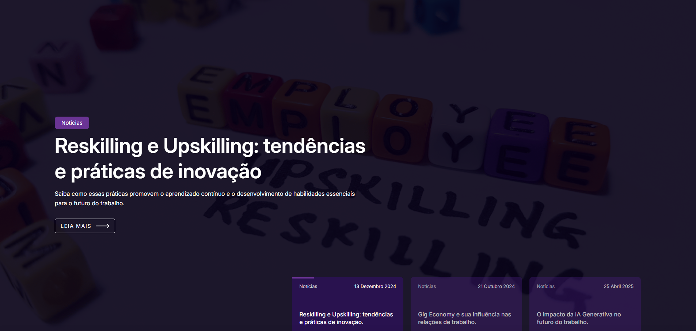

<div id="user-content-toc" align="left">
  <ul style="list-style: none;">
    <summary>
      <h1>Projeto: Plataforma ABRIR</h1>
    </summary>
  </ul>
</div>

<div align="left">
  
  
  
</div>
<br>


🔗 **LINK DO REPOSITÓRIO:** [Repositório Plataforma ABRIR](https://github.com/Calegor/FIAP_GS)
<br>
🔗 **Veja o site online:** [Turma do Bem](https://fiap-gs.vercel.app/)

> Projeto desenvolvido durante o curso da FIAP para o **Global Challenge**.
>
> O objetivo principal do trabalho é desenvolver um site completo e visualmente atraente para desktop, mobile e tablets, utilizando HTML, CSS e JavaScript.

---
## 🌟 Objetivo e Problema Resolvido
### O Problema: A Incerteza da Transição Digital
O avanço implacável da Inteligência Artificial, automação e robótica precipitou o futuro do trabalho, gerando uma crise de incerteza: milhões de empregos serão transformados, exigindo uma requalificação urgente e contínua. O maior problema não é a tecnologia em si, mas o risco iminente de exclusão social e econômica. Populações vulneráveis — que precisam de informação clara e acessível — são as que mais correm o risco de serem deixadas para trás nessa corrida tecnológica. O medo e a falta de um guia claro resultam em isolamento e estagnação profissional.

A Solução: **Plataforma ABRIR**, uma ponte para o futuro justo.
<br><br>
A Plataforma ABRIR é a resposta a esse desafio global. Nosso projeto resolve o problema da incerteza, transformando a ameaça digital em um mapa de oportunidades acessível e humanizado.

## 🎯 Missão do Site

A Plataforma ABRIR serve como um Hub de Requalificação Universal e um guia prático que capacita qualquer pessoa a ser protagonista da sua transição de carreira.

* **Diagnóstico Humanizado:** Servimos para que o usuário avalie seu Potencial de Transformação (Simulador), substituindo o pânico pela ação informada.
* **Guia de Ação (Reskilling):** Oferecemos o Mapa de Requalificação para dar um caminho claro e personalizado, focando nas habilidades humanas e tecnológicas mais demandadas.
* **Inclusão e Segurança:** Nosso diferencial é garantir que a jornada seja justa (Pilar Renda). Servimos como ponte para Comunidades de Apoio e informações sobre Proteção Social, assegurando que a tecnologia seja usada como uma ferramenta de empoderamento, e não de exclusão.

Nossa missão é clara: Usar a inovação para democratizar o acesso ao futuro, garantindo que a nova economia digital seja construída sobre os pilares da Renda, Inclusão e Acessibilidade.

---

## 📐 Resolução de Foco

O design foi desenvolvido e otimizado para as seguintes resoluções, conforme as regras da entrega:

> - **Extra small devices** (phones, 480px and down): @media (max-width: 480px) {...}
> - **Small devices** (portrait tablets and large phones, 481px and up): @media (min-width: 481px) {...}
> - **Medium devices** (landscape tablets, 768px and up): @media (min-width: 768px) {...}
> - **Large devices** (laptops/desktops, 992px and up): @media (min-width: 992px) {...}
> - **Extra-large devices** (large laptops and desktops, 1300px and up): @media (min-width: 1300px) {...}
  
---

## 💻 Entregas Funcionais (Global Challenge)

Abaixo estão as funcionalidades centrais do Frontend, que transformam a missão ABRIR em ferramentas interativas:

| Item | Status | Descrição |
| :--- | :---: | :--- |
| **Páginas Obrigatórias** | :heavy_check_mark: | Implementação de todas as páginas exigidas: **Index, Quem Somos/Integrantes, Sobre/About, FAQ e Contato**. |
| **Páginas Adicionais** | :heavy_check_mark: | Criação de páginas adicionais para a solução proposta, enriquecendo a arquitetura do site. |
| **Estrutura Base** | :heavy_check_mark: | Desenvolvimento utilizando **HTML semântico** (`<article>`, `<section>`, etc) e seguindo as diretrizes de acessibilidade básica. |
| **Estilização** | :heavy_check_mark: | Design visual intuitivo utilizando variáveis CSS para padronização de cores e temas. |
| **Interatividade CSS** | :heavy_check_mark: | Aplicação de **efeitos de `hover`**, `pseudo-classes` e **animações via `@keyframes`** para maior engajamento. |
| **Responsividade** | :heavy_check_mark: | Adaptação total do layout para diferentes dispositivos, incluindo mobile e tablets. |
| **Funcionalidades Dinâmicas** | :heavy_check_mark: | Implementação de **JavaScript** para formulários, validações e elementos interativos. |
| **Publicação (Deploy)** | :heavy_check_mark: | Publicação do projeto finalizado em plataforma de hospedagem (Vercel). |

---

## 🚀 Tecnologias e Ferramentas

| Categoria | Tecnologia | Uso no Projeto |
| :--- | :--- | :--- |
| **Estrutura** | **HTML5 Semântico** | Base para o site, garantindo acessibilidade e hierarquia. |
| **Estilo** | **CSS3** | Responsável por todo o design visual, responsividade e a **padronização de temas (variáveis e animações)**. |
| **Comportamento** | **JavaScript** | Adiciona funcionalidades dinâmicas, lógica de interatividade, simulador, mapa de requalificação e glossário, além da validações de formulários e gerencia a interatividade do usuário. |
| **Design/Recursos** | **Canva** | Utilizado para criação e redimensionamento de imagens, ícones e demais recursos gráficos. |

---

## 📂 Estrutura de pastas

```bash
├── assets
│   ├── css
│   │   └── base.css
│   │   └── blog.css
│   │   └── hero.css
│   │   └── layout.css
│   │   └── lg.css
│   │   └── md.css
│   │   └── navbar-footer.css
│   │   └── sm.css
│   │   └── xl.css
│   │   └── xs.css
│   ├── imgs
│   │   └── biblioteca
│   │   └── favicon
│   │   └── hero
│   │   └── integrantes
│   │   └── logo
│   │   └── redes-sociais
│   │   └── sobre
│   │   └── svg
│   ├── js
│   │   └── accordion.js
│   │   └── blog.js
│   │   └── cards.js
│   │   └── carrosselHero.js
│   │   └── dados.js
│   │   └── form.js
│   │   └── proposito.js
│   │   └── reskilling.js
│   │   └── scrollSmooth.js
│   │   └── search.js
│   │   └── simulator.js
│   │   └── tooltip.js
│   ├── assets-readme
│   │   └── imagem-github.png
│   │   └── julia-guimaraes.png
│   │   └── julia-spanopoulos.png
│   │   └── thiago-lima.png
│   ├── pages
│   │   └── blog.html
│   │   └── contato.html
│   │   └── faq.html
│   │   └── integrantes.html
│   │   └── proposito.html
│   │   └── reclassificacao.html
│   │   └── sobre.html
├── index.html
├── README.md

```

## 🤝 Colaboradores

Agradecemos às seguintes pessoas que contribuíram para este projeto:

<table>
  <tr>
    <td align="center">
      <a href="https://www.linkedin.com/in/juliarichesky/" target="_blank" title="LinkedIn Julia Guimarães">
        <br>
        <sub>
          <b>Julia Guimarães</b>
        </sub>
      </a>
      <br>
      <a href="https://github.com/juliarichesky" target="_blank" title="GitHub Julia Guimarães">
        <sub>
          <b>GitHub Julia Guimarães</b>
        </sub>
      </a>
      <br>
      <p>RM: 568275</p>
      <p>Turma: 1TDSPA</p>
    </td>
    <td align="center">
      <a href="https://www.linkedin.com/in/juspanopoulos/ target="_blank" title="LinkedIn Julia Spanopoulos">
        <br>
        <sub>
          <b>Julia Spanopoulos</b>
        </sub>
      </a>
      <br>
      <a href="https://github.com/juspanopoulos" target="_blank" title="GitHub Julia Spanopoulos">
        <sub>
          <b>GitHub Julia Spanopoulos</b>
        </sub>
      </a>
      <br>
      <p>RM: 566754</p>
      <p>Turma: 1TDSPA</p>
    </td>
    <td align="center">
      <a href="https://www.linkedin.com/in/thiago-gramorelli-lima-070097185/" target="_blank" title="LinkedIn Thiago Gramorelli">
        <br>
        <sub>
          <b>LinkedIn Thiago Gramorelli</b>
        </sub>
      </a>
      <br>
      <a href="https://github.com/Calegor" target="_blank" title="GitHub Thiago Gramorelli">
        <sub>
          <b>GitHub Thiago Gramorelli</b>
        </sub>
      </a>
      <br>
      <p>RM: 567630</p>
      <p>Turma: 1TDSPA</p>
    </td>
  </tr>
</table>
